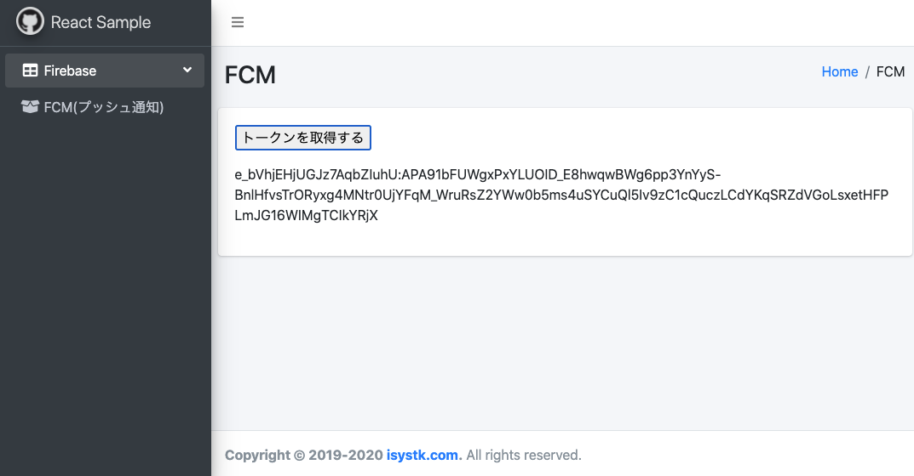
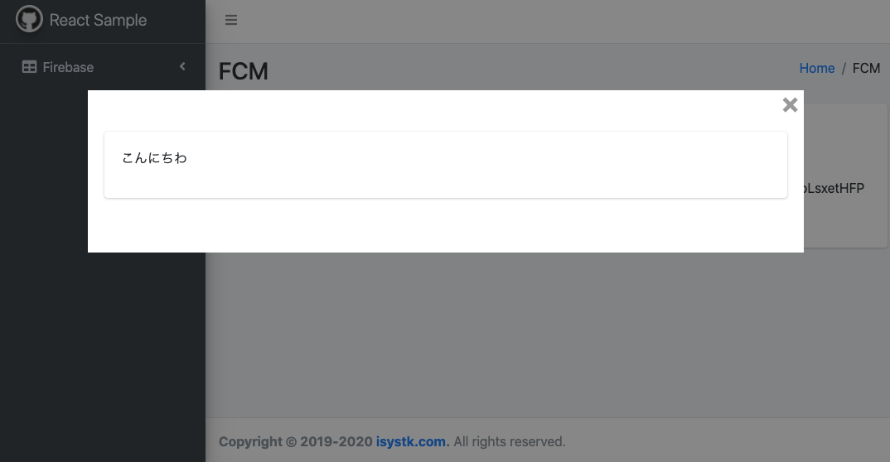

🌙 react-fcm
====


## 📗 プロジェクトの概要

Firebase Cloud Messaging を利用したプッシュ通知のサンプルアプリケーションです。

### 対象としている方
- FCM（Firebase Cloud Messaging）を利用してみたい方

### 利用している技術

#### ■ インフラ
- Apache 2.4.46　・・・　WebサーバーとしてApacheを採用しました。自己証明書を設定済みなので開発環境でSSLとして動作可能です。

#### ■ アプリケーション
- React 16.2.0
- React-Redux 7.2.2
- typescript 4.2.3
- Bootstrap 4.0.0
- Admin-LTE 3.1.0

## 🌐 Demo




## 📦 ディレクトリ構造

```
.
├── docker （各種Daemon）
│   │
│   └── apache （Webサーバー）
│       ├── conf.d (apacheの設定ファイル)
│       └── logs （apacheのログ）
│
├── htdocs （Apache公開ディレクトリ）
│   │
│   ├── public
│   ├── src
│   │   ├── sass
│   │   └── ts
│   ├── package.json
│   ├── tsconfig.json
│   └── webpack.mix.js
└── dc.sh （Dockerの起動用スクリプト）
```

## 🖊️ Docker 操作用シェルスクリプトの使い方

```
Usage:
  dc.sh [command] [<options>]

Options:
  stats|st                 Dockerコンテナの状態を表示します。
  init                     Dockerコンテナ・イメージ・生成ファイルの状態を初期化します。
  start                    すべてのDaemonを起動します。
  stop                     すべてのDaemonを停止します。
  apache restart           Apacheを再起動します。
  --version, -v     バージョンを表示します。
  --help, -h        ヘルプを表示します。
```

## 💬 使い方

```
# 下準備
$ ./dc.sh init

# サーバーを起動する
$ ./dc.sh start

# フロントエンドをビルドする。
$ cd htdocs
$ yarn && yarn run dev

# ブラウザでアクセス（ChromeはServiceWorkerがオレオレ証明書では動作しないので、オプションを付きで起動しています）
$ open -a /Applications/Google\ Chrome.app/Contents/MacOS/Google\ Chrome --args \
--unsafely-treat-insecure-origin-as-secure=https://localhost \
--allow-insecure-localhost \
--ignore-certificate-errors

# Curlで、プッシュ通知を送信します。
curl -X POST \
--header "Authorization: key={サーバーキー}" \
--header "project_id: key={送信者ID}" \
--header Content-Type:"application/json" \
https://fcm.googleapis.com/fcm/send \
-d @- << EOF
{
    "to": "トピック or registration_token",
    "notification": {
        "body": ""
    },
}
EOF

# サーバーを停止する場合
$ ./dc.sh stop
```

## 🎨 参考

| プロジェクト| 概要|
| :---------------------------------------| :-------------------------------|
| [Firebase Cloud Messagingで始めるWebプッシュ通知](https://qiita.com/ryo_hisano/items/1171beca22d5a04ed802)| Firebase Cloud Messagingで始めるWebプッシュ通知 |


## 🎫 Licence

[MIT](https://github.com/isystk/react-fcm/blob/master/LICENSE)

## 👀 Author

[isystk](https://github.com/isystk)

